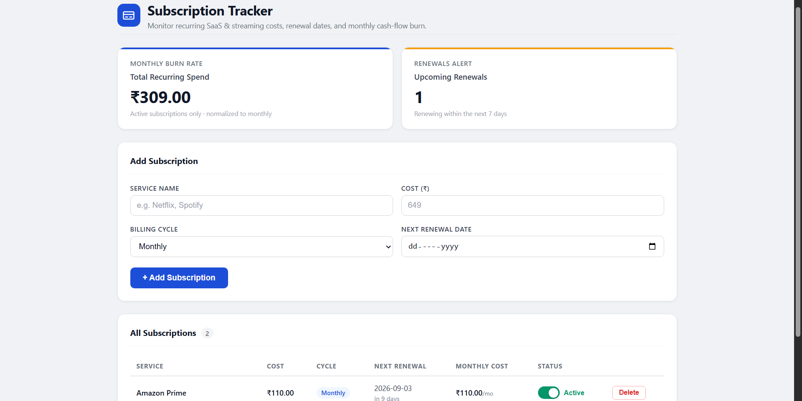

# Subscription Tracker & Renewal Dashboard

A full-stack personal finance dashboard for tracking recurring SaaS and streaming subscriptions, monitoring renewal dates, and understanding monthly recurring cash-flow burn.

## Preview



---

## Overview

The Subscription Tracker & Renewal Dashboard allows users to maintain a centralized view of their recurring subscriptions and understand their ongoing monthly financial commitment.

The dashboard supports both monthly and yearly billing cycles, automatically normalizes yearly subscriptions into monthly costs, highlights subscriptions approaching renewal, and provides an Active/Paused state for simulating potential savings.

---

## Features

- Add recurring SaaS and streaming subscriptions
- Support for **Monthly** and **Yearly** billing cycles
- Automatic yearly-to-monthly cost normalization
- Track the next renewal date for every subscription
- Detect subscriptions renewing within the next 7 days
- Display a **"Renewing Soon"** warning for upcoming renewals
- View total active monthly recurring burn
- View the number of upcoming renewals
- Pause and resume subscriptions without deleting them
- Visually distinguish paused subscriptions
- Automatically exclude paused subscription costs from Monthly Burn
- Delete subscriptions
- Persistent storage using SQLite

---

## Dashboard

The dashboard is organized around three main areas:

### 1. Monthly Metrics

The top-level metrics provide an immediate view of:

- **Total Monthly Burn Rate** — normalized monthly cost of all active subscriptions
- **Upcoming Renewals Alert Count** — subscriptions approaching their next renewal

### 2. Subscription Entry

Users can add a subscription by providing:

- Service name
- Cost
- Billing cycle
- Next renewal date

### 3. Subscription Table

Each subscription displays:

- Service
- Original cost
- Billing cycle
- Next renewal date
- Normalized monthly cost
- Active/Paused state
- Renewal warning when applicable

---

## Core Business Logic

### Cost Uniformity Engine

Subscriptions can use different billing cycles, so the dashboard normalizes all costs to a monthly value.

For monthly subscriptions:

```text
Monthly Cost = Original Cost
```

For yearly subscriptions:

```text
Monthly Cost = Annual Cost / 12
```

For example:

```text
₹12,000 / year
        ↓
₹1,000 / month
```

The original cost and billing cycle remain the source of truth.

---

### Renewal Detection

The backend calculates the number of days remaining until the next renewal.

A subscription is considered **"Renewing Soon"** when its renewal is between 0 and 7 days away.

```text
0 days  → Renewing Soon
1 day   → Renewing Soon
...
7 days  → Renewing Soon
8 days  → Normal
Past    → Normal
```

---

### Active / Paused Savings Simulation

Pausing a subscription does not remove it from the system.

Instead:

```text
Active
  ↓
Paused
```

The subscription remains visible but:

- Its row is visually greyed out
- Its cost is excluded from Monthly Burn
- It can be resumed later

This allows the dashboard to simulate the potential monthly savings from pausing recurring subscriptions.

---

## Architecture

```text
┌─────────────────────────────┐
│       React Frontend        │
│                             │
│ Dashboard / Form / Table    │
└──────────────┬──────────────┘
               │
               │ REST API
               ▼
┌─────────────────────────────┐
│       FastAPI Backend       │
│                             │
│ API Routes                  │
│ Business Logic              │
│ Validation                  │
└──────────────┬──────────────┘
               │
               ▼
┌─────────────────────────────┐
│         SQLAlchemy          │
│       Persistence Layer     │
└──────────────┬──────────────┘
               │
               ▼
┌─────────────────────────────┐
│           SQLite            │
└─────────────────────────────┘
```

The backend acts as the source of truth for subscription state and business calculations such as monthly cost normalization and renewal detection.

---

## Tech Stack

### Frontend

- React
- Vite
- CSS

### Backend

- FastAPI
- Pydantic
- SQLAlchemy

### Database

- SQLite

---

## Project Structure

```text
subscription-tracker/
│
├── backend/
│   ├── main.py
│   ├── database.py
│   ├── models.py
│   ├── schemas.py
│   └── requirements.txt
│
├── frontend/
│   ├── src/
│   │   ├── components/
│   │   │   ├── Header.jsx
│   │   │   ├── MetricsRow.jsx
│   │   │   ├── SubscriptionForm.jsx
│   │   │   └── SubscriptionTable.jsx
│   │   ├── api.js
│   │   ├── App.jsx
│   │   ├── App.css
│   │   └── main.jsx
│   ├── package.json
│   └── index.html
│
├── screenshots/
│   ├── dashboard.png
│   ├── renewal-alert.png
│   └── paused-savings.png
│
└── README.md
```

---

## Running Locally

### Prerequisites

- Python 3.9+
- Node.js
- npm

### 1. Start the Backend

```bash
cd backend

pip install -r requirements.txt

uvicorn main:app --reload
```

The FastAPI backend will start at `http://127.0.0.1:8000`.

### 2. Start the Frontend

Open a second terminal:

```bash
cd frontend

npm install
npm run dev
```

Open the local URL shown by Vite in your browser.

---

## API Endpoints

| Method | Endpoint | Description |
|--------|----------|-------------|
| `GET` | `/subscriptions` | List all subscriptions |
| `POST` | `/subscriptions` | Create a new subscription |
| `PATCH` | `/subscriptions/{id}/status` | Update Active/Paused status |
| `DELETE` | `/subscriptions/{id}` | Delete a subscription |
| `GET` | `/metrics` | Get Monthly Burn Rate and Renewal Alert Count |

---

## Example Workflow

```text
Add Netflix
₹649 / Monthly
        ↓
Monthly Burn = ₹649

Add AWS
₹12,000 / Yearly
        ↓
Normalized Monthly Cost = ₹1,000
        ↓
Monthly Burn = ₹1,649

Netflix renews in 6 days
        ↓
"Renewing Soon"

Pause Netflix
        ↓
Netflix remains visible (greyed out)
        ↓
Monthly Burn = ₹1,000

Resume Netflix
        ↓
Monthly Burn = ₹1,649
```

---

## Screenshots

### Dashboard


### Upcoming Renewal


### Pause & Savings Simulation


---

## Design Decisions

### Why SQLite?

SQLite keeps the application lightweight and easy to run locally while providing persistent storage without requiring a separate database server.

### Why keep business logic on the backend?

Monthly cost normalization and renewal calculations are business rules. Keeping them in the backend provides a single source of truth rather than duplicating logic in the frontend.

### Why does Paused not mean Deleted?

A paused subscription may become active again. Keeping it as a separate state preserves the user's subscription data while allowing the dashboard to simulate savings from temporarily disabling it.

---

## Future Improvements

Potential extensions for a production version:

- User authentication and multi-user support
- Automated renewal notifications
- Subscription categories and tagging
- Spending history and analytics charts
- PostgreSQL for production persistence
- Cloud deployment
- Recurring payment integrations

These are intentionally outside the scope of the current implementation.

---

## Built For

**Subscription Tracker & Renewal Dashboard — Quantiphi Vibe Coding Challenge**

A focused full-stack implementation emphasizing:

- Clean frontend interaction
- REST API design
- Backend business logic
- State management
- Cost normalization
- Date-based renewal calculations
- Persistent application state
